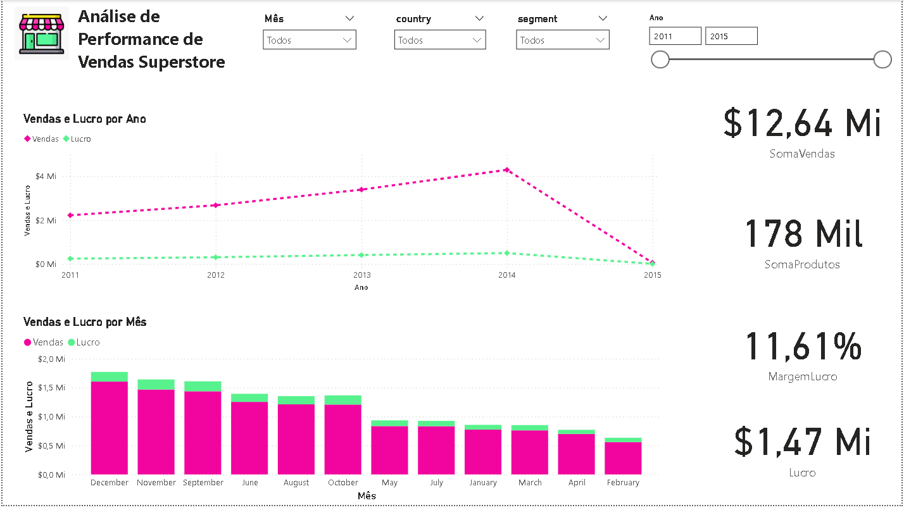
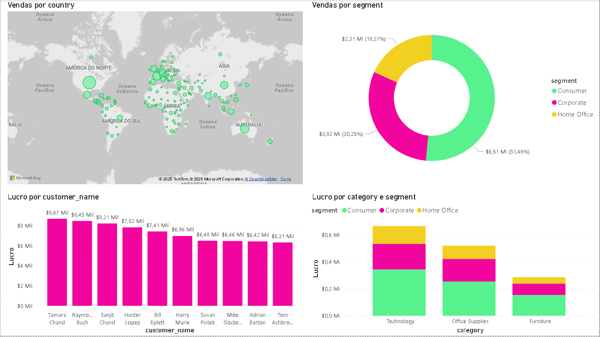
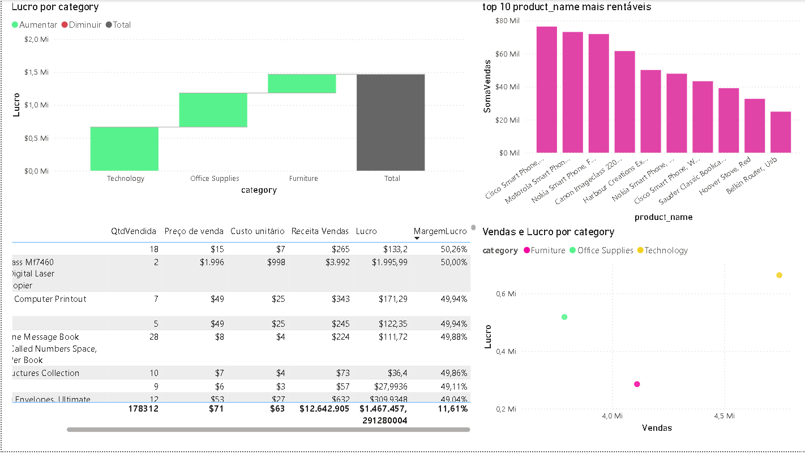

# 🛒 Super Store Data Analytics & ETL Project

## 📋 Sobre o Projeto

A **Super Store**, uma líder do setor de varejo, enfrentava o desafio de gerenciar grandes volumes de dados dispersos e desestruturados. O objetivo deste projeto foi implementar um pipeline **ETL (Extract, Transform, Load)** robusto para estruturar esses dados em um **Data Warehouse** no Google BigQuery, permitindo análises estratégicas de padrões de consumo e performance de vendas.

O projeto culminou em um Dashboard interativo para suporte à tomada de decisão.

---

## ⚙️ Arquitetura e Tecnologias

A solução foi desenvolvida utilizando a arquitetura de **Modelo Estrela (Star Schema)**, ideal para consultas analíticas rápidas.

***Linguagens:** Python (Pandas, Numpy, Requests, BeautifulSoup).
***Cloud & Data Warehouse:** Google BigQuery.
***Visualização de Dados:** Microsoft Power BI .
***Ambiente de Desenvolvimento:** Google Colab.

---

## 🚀 Etapas do Pipeline ETL

### 1. Extração (Extraction)
A ingestão de dados combinou fontes internas e enriquecimento com dados externos:
***Dados Transacionais:** Dataset `superstore.csv` contendo histórico de vendas, clientes e produtos.
***Web Scraping:** Extração automatizada de dados da Wikipédia (*List of supermarket chains*) utilizando `BeautifulSoup` para mapear concorrentes globais.

### 2. Transformação (Transformation)
Nesta etapa, os dados brutos foram higienizados e preparados utilizando Python:
***Limpeza de Dados:** Tratamento de valores nulos e remoção de duplicatas.
***Detecção de Outliers:** Aplicação do método estatístico **IQR (Interquartile Range)** para identificar anomalias em variáveis numéricas como `profit` (lucro) e `shipping_cost` (custo de envio).
***Padronização:** Normalização de strings (ex: capitalização de nomes) e conversão de tipos de dados (`datetime`).
***Engenharia de Atributos:** Criação da dimensão `Dim_Tempo` com derivação de Ano, Trimestre, Mês e Dia da Semana.

### 3. Modelagem de Dados (Star Schema)
Os dados foram estruturados em tabelas Fato e Dimensão:

| Tabela | Tipo | Descrição |
| :--- | :--- | :--- |
| **Fato_Vendas** | Fato |Tabela central contendo métricas (Vendas, Lucro, Quantidade) e chaves estrangeiras. |
| **Dim_Cliente** | Dimensão | Dados cadastrais. Implementação de **SCD Tipo 2 (Slowly Changing Dimension)** para rastrear histórico de mudanças no segmento do cliente. |
| **Dim_Produto** | Dimensão | Detalhes de produtos, categorias e subcategorias. |
| **Dim_Localidade** | Dimensão | Hierarquia geográfica completa (Cidade, Estado, País, Região, Mercado). |
| **Dim_Tempo** | Dimensão | Calendário mestre para análises temporais. |

### 4. Carga (Load)
Carregamento automatizado das tabelas transformadas para o dataset `project_rota01` no **Google BigQuery**, respeitando a integridade referencial e a ordem de dependência das tabelas (Dimensões primeiro, Fato depois).

---

## 📊 Estrutura do Dashboard

O painel no Power BI foi estruturado em três níveis de análise.

1.**Visão Executiva (KPIs):** Monitoramento macro de Vendas Totais, Lucro Líquido, Margem de Lucro e Custos Logísticos.
2.**Análise Temporal:** Evolução de vendas e lucro (YoY/MoM) e identificação de sazonalidade mensal.
3.**Visão Detalhada:** Mapa de vendas por região e performance por Categoria de Produto e Segmento de Cliente.

---

## 🛠️ Como Executar

1.  **Pré-requisitos:**
    * Conta no Google Cloud Platform (GCP).
    * Python 3.x instalado.
    * Bibliotecas: `pandas`, `google-cloud-bigquery`, `requests`, `beautifulsoup4`.

2.  **Configuração:**
    * Clone o repositório.
    * Configure as credenciais do GCP (`GOOGLE_APPLICATION_CREDENTIALS`).
    * [cite_start]Atualize as variáveis `PROJECT_ID` e `DATASET_ID` no script Python.

3.  **Execução:**
    * Execute o notebook `Rota01laboratoria.ipynb` para rodar o pipeline ETL completo.
    * Abra o arquivo `.pbix` no Power BI e atualize a fonte de dados para o seu projeto no BigQuery.

---

## ✒️ Autoria

Desenvolvido como projeto de aprofundamento em Engenharia de Dados e BI.